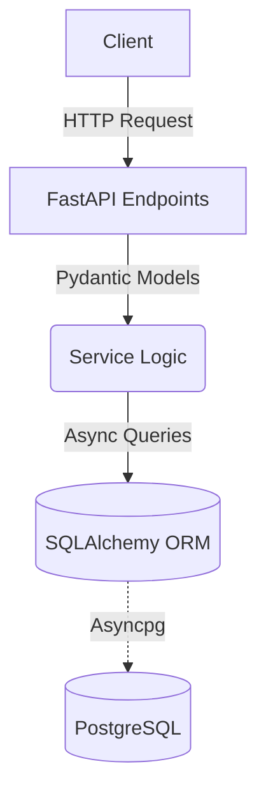

<h1 align="center">FastAPI (High-Performance Async Architecture)</h1>

<p align="center">
  
  
  
  
  
  
</p>

## 📖 Overview

A meticulously crafted API designed to maximize throughput and minimize latency using Python's modern `asyncio` capabilities. Built with **FastAPI**, this project demonstrates how to structure high-performance web applications that demand concurrent request handling without sacrificing code readability or structural integrity.

## 🏗️ Architecture & Design Choices

The architecture is heavily influenced by the need for non-blocking I/O and rapid data serialization. 

### Core Highlights
- **Asynchronous Core:** Fully async request lifecycle to handle high concurrency, leveraging FastAPI's ASGI foundation.
- **Data Validation:** Seamless request/response validation and serialization using `Pydantic` models.
- **ORM & Migrations:** Employs `SQLAlchemy 2.0` (async engine) for robust database interactions, tightly coupled with `Alembic` for reliable schema migrations.
- **Security First:** Implements secure password hashing (`argon2`) and stateless authentication using `JWT`.
- **Environment Management:** Powered by `Poetry` for deterministic dependency resolution.



## 🚀 Getting Started

### Prerequisites
- Python 3.13+
- Poetry (Package Manager)
- Docker & Docker Compose

### Running locally
1. Clone the repository and install dependencies via Poetry:
```bash
poetry install
```
2. Set up your environment variables:
```bash
cp .env.example .env
```
3. Spin up the database:
```bash
docker compose up -d
```
4. Run Alembic migrations:
```bash
poetry run task run_migrations
```
5. Start the application:
```bash
poetry run task run
```

The auto-generated interactive documentation will be available at `http://localhost:8000/docs`.

## 🧪 Testing
The test suite utilizes `pytest` with `pytest-asyncio` for full integration testing.

```bash
# Run the test suite
poetry run task test

# Run code coverage report
poetry run task post_test
```
